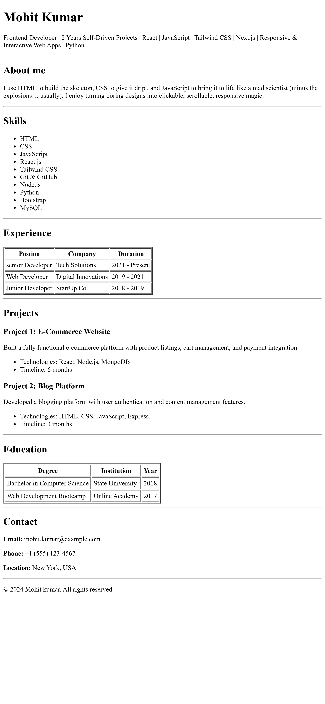
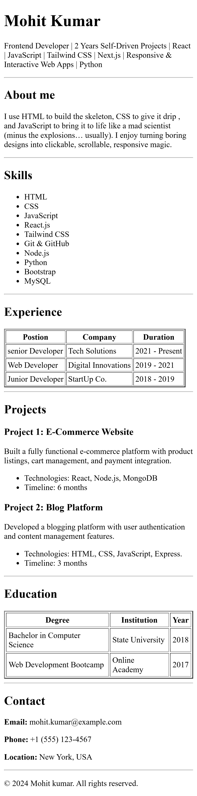

# Single Page Resume Website

This project is a single-page resume website created using pure HTML as part of a cohort assignment.

## 🔗 Live Demo
https://mohitverma-code7.github.io/Cohort-assignement/


## 📁 Project Structure
Cohort-assignment/
├── index.html
├── README.md
└── .github/workflows/deploy.yml


## 🛠️ Technologies Used
- HTML5
- GitHub Pages
- GitHub Actions

## ⚙️ Setup Instructions
1. Clone the repository:
   ```bash
   git clone https://github.com/mohitverma-code7/Cohort-assignment.git
   
2. Open `index.html` in your browser  
   OR  
   Use Live Server in VS Code

## 📸 Screenshots




